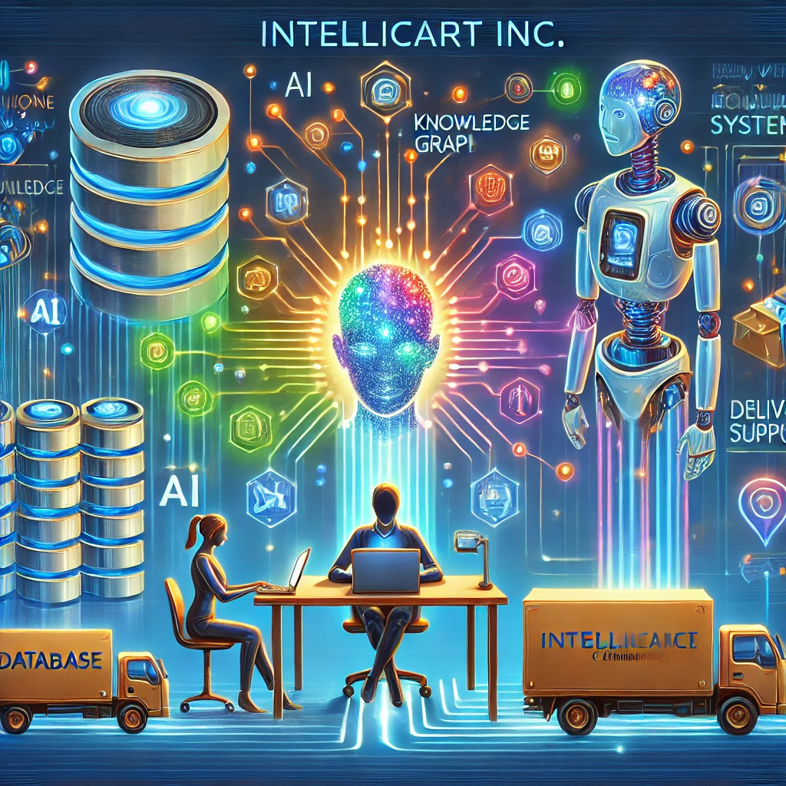

</img>

## Straight to the point
* [Pure LLM Customer Care](notebooks/pure_llm/Standalone_Pure_LLM_Customer_Care.ipynb)

## Introduction
Imagine an e-commerce company, `IntelliCart Inc.`, running a successful online shop where customers order products, triggering a chain of deliveries. While some deliveries go off smoothly, others might encounter issues, leading to customer inquiries. On top of that, users may raise tickets for claims that need prompt and efficient resolution. This scenario mirrors the **real-world** challenges of managing customer service in a thriving e-commerce business, touching on multiple facets of operations, from order handling to post-delivery support.

Let’s consider a typical customer message that demands a response:  

___  
*Hello,*  

*Thanks for the quick delivery. Could you please send me my last order total cost?*  

*Regards,*  
*John*  
___  

Addressing this request isn't as straightforward as it seems. To respond effectively, we need to:  
- Analyze and accurately interpret the intent behind the customer’s message.  
- Query the database to fetch the relevant details (e.g., the total cost of the last order).  
- Craft a clear, friendly, and satisfactory reply.  

This use case is quite realistic and includes different aspects of an e-commerce company's activities. Addressing all this seamlessly requires a robust AI-powered customer care system, that we'll hopefully be building in this tutorial.